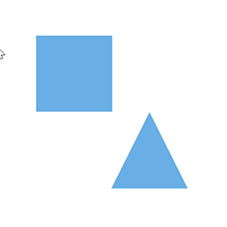
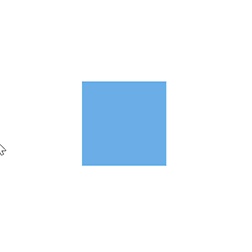
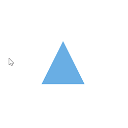
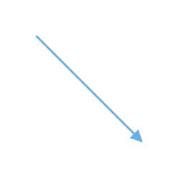
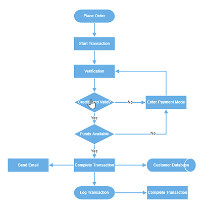

# Interaction

## Selection

Selector provides a visual representation of selected elements. It behaves like a container and allows to update the size, position, and rotation angle of the selected elements through interaction and by using program. Single or multiple elements can be selected at a time.

## Single selection

An element can be selected by clicking that element. During single click, all previously selected items are cleared. The following image shows how the selected elements are visually represented.


* While selecting the diagram elements, the following events can be used to do your customization.
* When selecting/unselecting the diagram elements, the [`selectionChange`](https://help.syncfusion.com/cr/aspnetcore-js2/Syncfusion.EJ2.Diagrams.Diagram.html#Syncfusion_EJ2_Diagrams_Diagram_SelectionChange) event gets triggered.

## Selecting a group

When a child element of any group is clicked, its contained group is selected instead of the child element. With consecutive clicks on the selected element, selection is changed from top to bottom in the hierarchy of parent group to its children.

## Multiple selection

Multiple elements can be selected with the following ways:

* Ctrl+Click

During single click, any existing item in the selection list be cleared, and only the item clicked recently is there in the selection list. To avoid cleaning the old selected item, Ctrl key must be on hold when clicking.


* Selection rectangle/rubber band selection

Clicking and dragging the diagram area allows to create a rectangular region. The elements that are covered under the rectangular region are selected at the end.



## Select/Unselect elements using program

The client-side methods [`select`](https://help.syncfusion.com/cr/aspnetcore-js2/Syncfusion.EJ2.Diagrams.html) and [`clearSelection`](https://help.syncfusion.com/cr/aspnetcore-js2/Syncfusion.EJ2.Diagrams.html) help to select or clear the selection of the elements at runtime. The following code example illustrates how to select or clear the selection of an item using program.

Get the current selected items from the [`nodes`](https://help.syncfusion.com/cr/aspnetcore-js2/Syncfusion.EJ2.Diagrams.DiagramSelector.html#Syncfusion_EJ2_Diagrams_DiagramSelector_Nodes) and [`connectors`](https://help.syncfusion.com/cr/aspnetcore-js2/Syncfusion.EJ2.Diagrams.DiagramSelector.html#Syncfusion_EJ2_Diagrams_DiagramSelector_Connectors) collection of the [`selectedItems`](https://help.syncfusion.com/cr/aspnetcore-js2/Syncfusion.EJ2.Diagrams.Diagram.html#Syncfusion_EJ2_Diagrams_Diagram_SelectedItems) property of the diagram model.

## Select entire elements in diagram programmatically

The client-side method [`selectAll`](https://help.syncfusion.com/cr/aspnetcore-js2/Syncfusion.EJ2.Diagrams.html) used to select all the elements such as nodes/connectors in the diagram. Refer to the following link which shows how to use [`selectAll`](https://help.syncfusion.com/cr/aspnetcore-js2/Syncfusion.EJ2.Diagrams.html) method on the diagram.

## Drag

* An object can be dragged by clicking and dragging it. When multiple elements are selected, dragging any one of the selected elements move every selected element.
* When you drag the elements in the diagram, the [`positionChange`](https://help.syncfusion.com/cr/aspnetcore-js2/Syncfusion.EJ2.Diagrams.Diagram.html#Syncfusion_EJ2_Diagrams_Diagram_PositionChange) event gets triggered and to do customization in this event.


## Resize

* Selector is surrounded by eight thumbs. When dragging these thumbs, selected items can be resized.
* When one corner of the selector is dragged, opposite corner is in a static position.
* When a node is resized, the [`sizeChange`](https://help.syncfusion.com/cr/aspnetcore-js2/Syncfusion.EJ2.Diagrams.Diagram.html#Syncfusion_EJ2_Diagrams_Diagram_SizeChange) event gets triggered.



>Note:  While dragging and resizing, the objects are snapped towards the nearest objects to make better alignments. For better alignments, refer to `Snapping`.

## Rotate

* A rotate handler is placed above the selector. Clicking and dragging the handler in a circular direction lead to rotate the node.
* The node is rotated with reference to the static pivot point.
* Pivot thumb (thumb at the middle of the node) appears while rotating the node to represent the static point.



## Connection editing

* Each segment of a selected connector is editable with some specific handles/thumbs.

>Note: For connector editing, you have to inject the [`ConnectorEditing`](https://ej2.syncfusion.com/documentation/api/diagram/connectorEditing) module.

## End point handles

Source and target points of the selected connectors are represented with two handles. Clicking and dragging those handles help you to adjust the source and target points.


* If you drag the connector end points, then the following events can be used to do your customization.
* When the connector source point is changed, the [`sourcePointChange`](https://help.syncfusion.com/cr/aspnetcore-js2/Syncfusion.EJ2.Diagrams.Diagram.html#Syncfusion_EJ2_Diagrams_Diagram_SourcePointChange) event gets triggered.
* When the connector target point is changed, the [`targetPointChange`](https://help.syncfusion.com/cr/aspnetcore-js2/Syncfusion.EJ2.Diagrams.Diagram.html#Syncfusion_EJ2_Diagrams_Diagram_TargetPointChange) event gets triggered.
* When you connect connector with ports/node or disconnect from it, the [`connectionChange`](https://help.syncfusion.com/cr/aspnetcore-js2/Syncfusion.EJ2.Diagrams.Diagram.html#Syncfusion_EJ2_Diagrams_Diagram_ConnectionChange) event gets triggered.

## Straight segment editing

* End point of each straight segment is represented by a thumb that enables to edit the segment.
* Any number of new segments can be inserted into a straight line by clicking, when Shift and Ctrl keys are pressed (Ctrl+Shift+Click).



* Straight segments can be removed by clicking the segment end point, when Ctrl and Shift keys are pressed (Ctrl+Shift+Click).


## Orthogonal thumbs

* Orthogonal thumbs allow you to adjust the length of adjacent segments by clicking and dragging it.
* When necessary, some segments are added or removed automatically, when dragging the segment. This is to maintain proper routing of orthogonality between segments.


## Bezier thumbs

* Bezier segments are annotated with two thumbs to represent the control points. Control points of the curve can be configured by clicking and dragging the control thumbs.


## Drag and drop nodes over other elements

Diagram provides support to drop a node/connector over another node/connector. The [`drop`](https://help.syncfusion.com/cr/aspnetcore-js2/Syncfusion.EJ2.Diagrams.Diagram.html#Syncfusion_EJ2_Diagrams_Diagram_Drop) event is raised to notify that an element is dropped over another one and it is disabled, by default. It can enabled with the constraints property.

## User handles

* User handles are used to add some frequently used commands around the selector. To create user handles, define and add them to the [`userHandles`](https://help.syncfusion.com/cr/aspnetcore-js2/Syncfusion.EJ2.Diagrams.DiagramUserHandle.html) collection of the [`selectedItems`](https://help.syncfusion.com/cr/aspnetcore-js2/Syncfusion.EJ2.Diagrams.Diagram.html#Syncfusion_EJ2_Diagrams_Diagram_SelectedItems) property.
* The name property of user handle is used to define the name of the user handle and its further used to find the user handle at runtime and do any customization.

## Alignment

User handles can be aligned relative to the node boundaries. It has [`margin`](https://help.syncfusion.com/cr/aspnetcore-js2/Syncfusion.EJ2.Diagrams.DiagramUserHandle.html#Syncfusion_EJ2_Diagrams_DiagramUserHandle_Margin), [`offset`](https://help.syncfusion.com/cr/aspnetcore-js2/Syncfusion.EJ2.Diagrams.DiagramUserHandle.html#Syncfusion_EJ2_Diagrams_DiagramUserHandle_Offset), [`side`](https://help.syncfusion.com/cr/aspnetcore-js2/Syncfusion.EJ2.Diagrams.DiagramUserHandle.html#Syncfusion_EJ2_Diagrams_DiagramUserHandle_Side), [`horizontalAlignment`](https://help.syncfusion.com/cr/aspnetcore-js2/Syncfusion.EJ2.Diagrams.DiagramUserHandle.html#Syncfusion_EJ2_Diagrams_DiagramUserHandle_HorizontalAlignment), and [`verticalAlignment`](https://help.syncfusion.com/cr/aspnetcore-js2/Syncfusion.EJ2.Diagrams.DiagramUserHandle.html#Syncfusion_EJ2_Diagrams_DiagramUserHandle_VerticalAlignment) settings. It is quite tricky when all four alignments are used together but gives more control over alignment.

## Offset

The [`offset`](https://help.syncfusion.com/cr/aspnetcore-js2/Syncfusion.EJ2.Diagrams.DiagramUserHandle.html#Syncfusion_EJ2_Diagrams_DiagramUserHandle_Offset) property of [`userHandles`](https://help.syncfusion.com/cr/aspnetcore-js2/Syncfusion.EJ2.Diagrams.DiagramUserHandle.html) is used to align the user handle based on fractions. 0 represents top/left corner, 1 represents bottom/right corner, and 0.5 represents half of width/height.

## Side

The [`side`](https://help.syncfusion.com/cr/aspnetcore-js2/Syncfusion.EJ2.Diagrams.DiagramUserHandle.html#Syncfusion_EJ2_Diagrams_DiagramUserHandle_Side) property of [`userHandles`](https://help.syncfusion.com/cr/aspnetcore-js2/Syncfusion.EJ2.Diagrams.DiagramUserHandle.html) is used to align the user handle by using the [`Top`](https://help.syncfusion.com/cr/aspnetcore-js2/Syncfusion.EJ2.Diagrams.Side.html), [`Bottom`](https://help.syncfusion.com/cr/aspnetcore-js2/Syncfusion.EJ2.Diagrams.Side.html), [`Left`](https://help.syncfusion.com/cr/aspnetcore-js2/Syncfusion.EJ2.Diagrams.Side.html), and [`Right`](https://help.syncfusion.com/cr/aspnetcore-js2/Syncfusion.EJ2.Diagrams.Side.html) options.

## Horizontal and vertical alignments

The [`horizontalAlignment`](https://help.syncfusion.com/cr/aspnetcore-js2/Syncfusion.EJ2.Diagrams.DiagramUserHandle.html#Syncfusion_EJ2_Diagrams_DiagramUserHandle_HorizontalAlignment) property of [`userHandles`](https://help.syncfusion.com/cr/aspnetcore-js2/Syncfusion.EJ2.Diagrams.DiagramUserHandle.html) is used to set how the user handle is horizontally aligned at the position based on the [`offset`](https://help.syncfusion.com/cr/aspnetcore-js2/Syncfusion.EJ2.Diagrams.DiagramUserHandle.html#Syncfusion_EJ2_Diagrams_DiagramUserHandle_Offset). The [`verticalAlignment`](https://help.syncfusion.com/cr/aspnetcore-js2/Syncfusion.EJ2.Diagrams.DiagramUserHandle.html#Syncfusion_EJ2_Diagrams_DiagramUserHandle_VerticalAlignment) property is used to set how user handle is vertically aligned at the position.

## Margin

Margin is an absolute value used to add some blank space in any one of its four sides. The [`userHandles`](https://help.syncfusion.com/cr/aspnetcore-js2/Syncfusion.EJ2.Diagrams.DiagramUserHandle.html) can be displaced with the [`margin`](https://help.syncfusion.com/cr/aspnetcore-js2/Syncfusion.EJ2.Diagrams.DiagramUserHandle.html#Syncfusion_EJ2_Diagrams_DiagramUserHandle_Margin) property.

## Notification for the mouse button clicked

The diagram component notifies the mouse button clicked. For example, whenever the right mouse button is clicked, the clicked button is notified as right. The mouse click is notified with,

| Notification | Description |
|----------------|--------------|
| Left | When the left mouse button is clicked, left is notified  |
| Middle | When the mouse wheel is clicked, middle is notified |
| Right | When the right mouse button is clicked, right is notified |





```javascript

function click(arg) {
    //Obtains the clicked mouse button
    var button = arg.button
}

```

## Appearance

The appearance of the user handle can be customized by using the [`size`](https://help.syncfusion.com/cr/aspnetcore-js2/Syncfusion.EJ2.Diagrams.DiagramUserHandle.html#Syncfusion_EJ2_Diagrams_DiagramUserHandle_Size), [`borderColor`](https://help.syncfusion.com/cr/aspnetcore-js2/Syncfusion.EJ2.Diagrams.DiagramUserHandle.html#Syncfusion_EJ2_Diagrams_DiagramUserHandle_BorderColor), [`backgroundColor`](https://help.syncfusion.com/cr/aspnetcore-js2/Syncfusion.EJ2.Diagrams.DiagramUserHandle.html#Syncfusion_EJ2_Diagrams_DiagramUserHandle_BackgroundColor), [`visible`](https://help.syncfusion.com/cr/aspnetcore-js2/Syncfusion.EJ2.Diagrams.DiagramUserHandle.html#Syncfusion_EJ2_Diagrams_DiagramUserHandle_Visible), [`pathData`](https://help.syncfusion.com/cr/aspnetcore-js2/Syncfusion.EJ2.Diagrams.DiagramUserHandle.html#Syncfusion_EJ2_Diagrams_DiagramUserHandle_PathData), and [`pathColor`](https://help.syncfusion.com/cr/aspnetcore-js2/Syncfusion.EJ2.Diagrams.DiagramUserHandle.html#Syncfusion_EJ2_Diagrams_DiagramUserHandle_PathColor) properties of the [`userHandles`](https://help.syncfusion.com/cr/aspnetcore-js2/Syncfusion.EJ2.Diagrams.DiagramUserHandle.html).





```javascript

function getTool(action) {
        var tool;
        if (action === 'clone') {
            tool = new CloneTool(diagram.commandHandler);
        }
        return tool;
    }
    var __extends = (this && this.__extends) || (function () {
    var extendStatics = Object.setPrototypeOf ||
        /* jshint proto: true */
        ({ __proto__: [] } instanceof Array && function (d, b) { d.__proto__ = b; }) ||
        function (d, b) { for (var p in b) if (b.hasOwnProperty(p)) d[p] = b[p]; };
    return function (d, b) {
        extendStatics(d, b);
        function __() { this.constructor = d; }
        d.prototype = b === null ? Object.create(b) : (__.prototype = b.prototype, new __());
    };
})();
var CloneTool = (function (_super) {
    __extends(CloneTool, _super);
    function CloneTool() {
        return _super !== null && _super.apply(this, arguments) || this;
    }
    CloneTool.prototype.mouseDown = function (args) {
        var newObject;
        if (diagram.selectedItems.nodes.length > 0) {
            newObject = ej.diagrams.cloneObject(diagram.selectedItems.nodes[0]);
        }
        else {
            newObject = ej.diagrams.cloneObject(diagram.selectedItems.connectors[0]);
        }
        newObject.id += ej.diagrams.randomId();
        diagram.paste([newObject]);
        args.source = diagram.nodes[diagram.nodes.length - 1];
        args.sourceWrapper = args.source.wrapper;
        _super.prototype.mouseDown.call(this, args);
        this.inAction = true;
    };
    return CloneTool;
}(ej.diagrams.MoveTool));

```

## Zoom pan

* When a large diagram is loaded, only certain portion of the diagram is visible. The remaining portions are clipped. Clipped portions can be explored by scrolling the scrollbars or panning the diagram.
* Diagram can be zoomed in or out by using Ctrl + mouse wheel.
* When the diagram is zoomed or panned, the [`scrollChange`](https://help.syncfusion.com/cr/aspnetcore-js2/Syncfusion.EJ2.Diagrams.Diagram.html#Syncfusion_EJ2_Diagrams_Diagram_ScrollChange) event gets triggered.



## Zoom pan status

Diagram provides the support to notify the pan status of the zoom pan tool. When ever the diagram is panning the [`scrollChange`](https://help.syncfusion.com/cr/aspnetcore-js2/Syncfusion.EJ2.Diagrams.Diagram.html#Syncfusion_EJ2_Diagrams_Diagram_ScrollChange) event is triggered and hence the pan status can be obtained. The pan status is notified with Start, Progress, and Completed.

|  Pan Status  | Description|
|--------------|------------|
| Start | When the mouse is clicked and dragged the status is notified as start.|
| Progress | When the mouse is in motion the status is notified as progress.|
| Completed | When panning is stopped the status is notified with completed.|





```javascript

function Created() {
    var diagram = document.getElementById("container").ej2_instances[0];
    diagram.tool = DiagramTools.ZoomPan;
    diagram.dataBind();
    }
function scrollChange(args) {
    var panStatus = args.panState
}

```

## Keyboard

Diagram provides support to interact with the elements with key gestures. By default, some in-built commands are bound with a relevant set of key combinations.

The following table illustrates those commands with the associated key values.

| Shortcut Key | Command | Description|
|--------------|---------|------------|
| Ctrl + A | `selectAll` | Select all nodes/connectors in the diagram.|
| Ctrl + C | copy | Copy the diagram selected elements.|
| Ctrl + V | paste | Pastes the copied elements.|
| Ctrl + X | cut | Cuts the selected elements.|
| Ctrl + Z | undo | Reverses the last editing action performed on the diagram.|
| Ctrl + Y | redo | Restores the last editing action when no other actions have occurred since the last undo on the diagram.|
| Delete | delete | Deletes the selected elements.|
| Ctrl/Shift + Click on object |  | Multiple selection (Selector binds all selected nodes/connectors).|
| Up Arrow | nudge(“up”) | `nudgeUp`: Moves the selected elements towards up by one pixel.|
| Down Arrow | nudge(“down”) | `nudgeDown`: Moves the selected elements towards down by one pixel.|
| Left Arrow | nudge(“left”) | `nudgeLeft`: Moves the selected elements towards left by one pixel.|
| Right Arrow | nudge(“right”) | `nudgeRight`: Moves the selected elements towards right by one pixel.|
| Ctrl + MouseWheel | zoom | Zoom (Zoom in/Zoom out the diagram).|
| F2 | `startLabelEditing` | Starts to edit the label of selected element.|
| Esc | `endLabelEditing` | Sets the label mode as view and stops editing.|

## See Also

* [How to create diagram nodes using drawing tools](./tools#shapes)
* [How to create diagram connectors using drawing tools](./tools#connectors )
* [How to disable the diagram interaction](./tools)
* [How to control the diagram history](./undo-redo)
* [How to create overview control to the diagram](./overview)