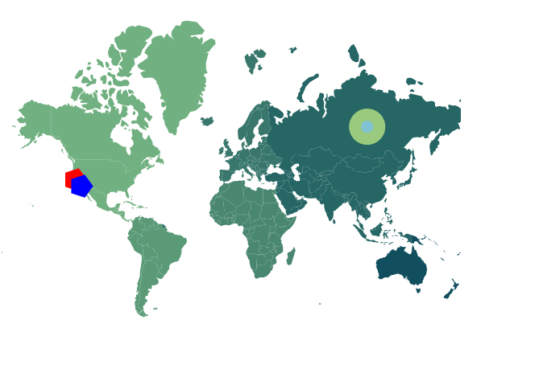

# Populate data

This section explains how to populate data inputs and provide it to the Maps component.

## Shape data

The shape data collection describes geographical shape information that is available in GeoJSON format. The Map shapes are rendered with this data. The custom shapes such as seat selection in bus, seat selection in a cricket stadium and more useful information can be also added as ShapeData in the layer of the Maps.

## Data source

The `DataSource` property is used to represent statistical data in the Maps component, and it accepts a collection of values as input. For example, a list of objects as input can be provided to the data source. This data source will be used to color the map, display data labels, and display tooltip, among other things.

The data source is populated with JSON data relative to shape data and stored as JSON object. In the below example, the below JSON object can be used as data source in Maps.

```json
[
    {
        'code': 'AF',
        'value': 53,
        'name': 'Afghanistan',
        'population': 29863010,
        'density': 119
    },
    {
        'code': 'AL',
        'value': 117,
        'name': 'Albania',
        'population': 3195000,
        'density': 111
    },
    {
        'code': 'DZ',
        'value': 15,
        'name': 'Algeria',
        'population': 34895000,
        'density': 15
    },
    {
        'code': 'AO',
        'value': 15,
        'name': 'Angola',
        'population': 18498000,
        'density': 15
    },
    {
        'code': 'AR',
        'value': 15,
        'name': 'Argentina',
        'population': 40091359,
        'density': 14
    },
    {
        'code': 'AM',
        'value': 109,
        'name': 'Armenia',
        'population': 3230100,
        'density': 108
    }
]

```

## Data binding

The following properties in the `Layers` are used for binding data in the Maps component. Both the properties are related to each other.

* ShapePropertyPath
* ShapeDataPath

### ShapePropertyPath

The `ShapePropertyPath` property is used to refer the field name in the `ShapeData` property of shape layers to identify the shape. When the values of `ShapeDataPath` property from the `DataSource` property and `ShapePropertyPath` property from the `ShapeData` property match, then the associated object from the data source is bound to the corresponding shape.

> `world-map.json` file contains following data and its field **"name"** value is used to map the corresponding shape with the provided data source.

```json
{
    "type": "Feature",
    "properties": {
        "admin": "Afghanistan",
        "name": "Afghanistan",
        "continent": "Asia"
    },
    "geometry": { "type": "Polygon", "coordinates": [[[61.21081709172573, ... },
...
}

```

### ShapeDataPath

The `ShapeDataPath` property is similar to the `ShapePropertyPath` property, but it refers to the field name in the `DataSource` property. For example, [populationData](#data-source) contains the **code**, **value**, **name**, **population** and **density** fields. Here, the **name** field is set to the shapeDataPath to map the corresponding value of field name in shape data.

In the below example, both "**name**" fields contain the same value as "**Afghanistan**", this value is matched in both shape data and data source, so that the details associated with "**Afghanistan**" will be mapped to the corresponding shape and used to color the corresponding shape, display data labels, display tooltips, and more.






## Binding complex data source

Data from data source can be bind to the Maps in two different ways.

1. Bind the field name directly to the properties as `ShapeDataPath`, `ColorValuePath`, `ValuePath` and `ShapeValuePath`.

2. Bind the field name as `data.field` to the properties as `ShapeDataPath`, `ColorValuePath`, `ValuePath` and `ShapeValuePath`.

Refer complex support for data source as illustrated in the following example. Also, refer the data values for [ViewBag.bubbleData](https://www.syncfusion.com/downloads/support/directtrac/general/ze/BubbleData-103021339), [ViewBag.complexData](https://www.syncfusion.com/downloads/support/directtrac/general/ze/ComplexData1459638658) and [ViewBag.markerData](https://www.syncfusion.com/downloads/support/directtrac/general/ze/MarkerData357696841) here.






