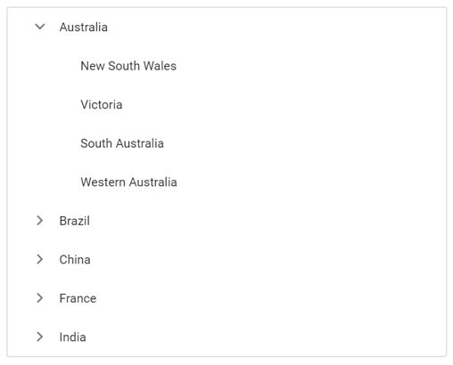

# Getting Started

 This section briefly explains about how to include a simple TreeView in your ASP.NET MVC application. You can refer [ASP.NET MVC Getting Started documentation](../getting-started/) page for introduction part part of the system requirements and configure the common specifications.

## Adding control to the Application

TreeView control can be rendered by using the `EJS().TreeView()` tag helper in ASP.NET MVC application. Add the below simple code to your `index.cshtml` page which is available within the `Views/Home` folder, to initialize the TreeView.

The following example shows a basic TreeView control.





## Binding data source

TreeView can load data either from local data sources or remote data services. This can be done using the dataSource property that is a member of the fields property. The dataSource property supports array of JavaScript objects and DataManager. Here, an array of JSON values is passed to the TreeView control.





Output be like the below.

