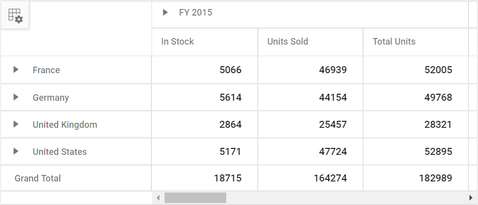

# Getting Started with ASP.NET MVC

> Starting with v16.2.0.x, if you reference Syncfusion assemblies from trial setup or from the NuGet feed, you also have to include a license key in your projects. Please refer to this [link](https://help.syncfusion.com/common/essential-studio/licensing/license-key) to know about registering Syncfusion license key in your ASP.NET MVC application to use our components.

## Prerequisites

To get start with ASP.NET MVC application, need to ensure the following software to be installed on the machine.

1. .Net Framework 4.5 and above.
2. ASP.NET MVC 4 or ASP.NET MVC 5
3. Visual Studio

## Preparing ASP.NET MVC application

Follow below steps to create ASP.NET MVC Application.

**Step 1:** Create ASP.NET MVC Application with default template project in Visual Studio.


**Step 2:** Once your project is created, we need to add Syncfusion EJ2 package into your application using `NuGet Package Manager`.

Follow the below steps to add **Syncfusion EJ2** package in your application.

* Select the "Tools->NuGet Package Manager->Package Manager settings", a dialog window will open.

* Navigate to the "NuGet Package Manager->Package Sources" from the options dialog.

* Click the **Add** button to create the new package sources.

* Select the newly created "Package Source" and rename the source name using the "Name" input box.

  **Name**: Name of the package that listed in "Available package sources".

  **Source**: Syncfusion ASP.NET Core NuGet Package feed URL


**Step 3:** Once the **Syncfusion EJ2** package is added, open `nuGet` package manager window.

> To open `nuGet` package manager window, right click on the project and select **Manage NuGet Packages** option.


Install the **Syncfusion.EJ2.MVC4** package to the application.


> Also you will find more details to add Syncfusion EJ2 package to your application [here](../nuget-packages.html).

After installation is completed, it will included in the project. You can refer it in the "Assembly Reference" of your project.

> We need to install **NewtonSoft.JSON** as a dependency, since **Syncfusion.EJ2.MVC4** is dependent to NewtonSoft.JSON package.

## Adding reference

Add `Syncfusion.EJ2` namespace and its assembly reference in `Views/Web.Config`.

```cs
<namespaces>
    <add namespace="Syncfusion.EJ2"/>
</namespaces>

```

```cs
<system.web>
    <compilation>
      <assemblies>
        <add assembly="Syncfusion.EJ2, Culture=neutral" />
      </assemblies>
    </compilation>
  </system.web>
```

## Adding client side resource

Add client side resource through [`CDN`](http://ej2.syncfusion.com/15.4.23/documentation/base/deployment.html?lang=typescript#cdn) or local [`package`](https://www.npmjs.com/package/@syncfusion/ej2) in the layout page **Views/Shared/_Layout.cshtml.**

```html
<head>
@* Syncfusion Essential JS 2 Styles *@
<link rel="stylesheet" href="https://cdn.syncfusion.com/ej2/material.css" />

@* Syncfusion Essential JS 2 Scripts *@
<script src="https://cdn.syncfusion.com/ej2/dist/ej2.min.js"></script>
</head>
```

You can also install the NuGet package **`Syncfusion.EJ2.JavaScript`** which have the client-side dependencies (Scripts and Styles) of the Essential JS 2 components.

## Adding ScriptManager

Add the Script Manager reference in the layout page `Views/Shared/_Layout.cshtml`. The Script Manager need to be added after body rendered.

```html
<body>
    @RenderBody()
    @Scripts.Render("~/bundles/jquery")
    @Scripts.Render("~/bundles/bootstrap")
    @RenderSection("scripts", required: false)
    @Html.EJS().ScriptManager()
</body>
```

## Adding component to the application

Add the below code to your `Index.cshtml` view page which is present under `Views/Home` folder, to initialize the pivot grid component.





## Enable Grouping Bar

The Grouping Bar feature automatically populates fields from the bound data source and allows end users to drag fields between different axes such as columns, rows, values, and filters, and create pivot views at runtime. It can be enabled by setting the `ShowGroupingBar` property to **true**.





## Enable Pivot Field List

The component provides a built-in Field List similar to Microsoft Excel. It allows you to add or remove fields and also rearrange the fields between different axes, including column, row, value, and filter along with filter and sort options dynamically at runtime. It can be enabled by setting the `ShowFieldList` property to **true**.





## Calculated field

The calculated field feature allows user to insert or add a new calculated field based on the available fields from the bound datasource. It can be customized using the `CalculatedFieldsSettings` property through code behind. The setting required for calculate field feature at code behind are:
* `Name`: it allows to indicate the given calculated field with unique name.
* `Formula`: it allows to set the formula base on the given datasource.

Also calculated fields can be added to the bound datasource at run time through the built-in popup. The popup can be enabled by setting the `AllowCalculatedField` property to **true**.

> Calculated field is applicable only for value fields.





Output be like the below.

